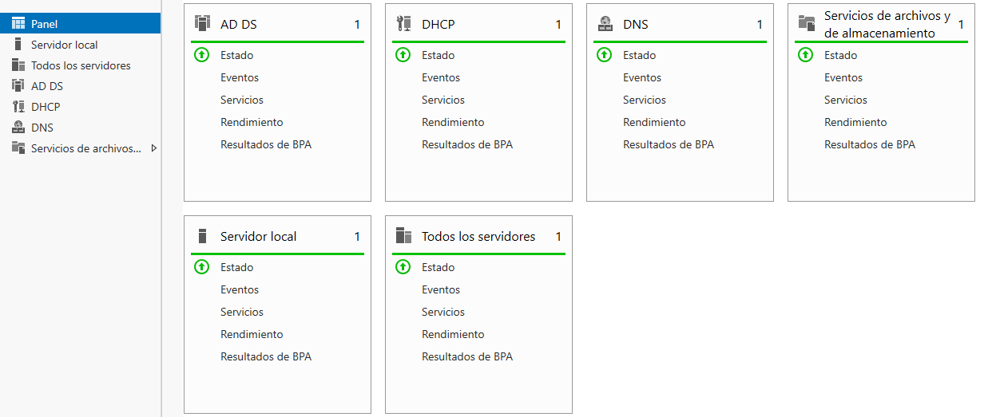
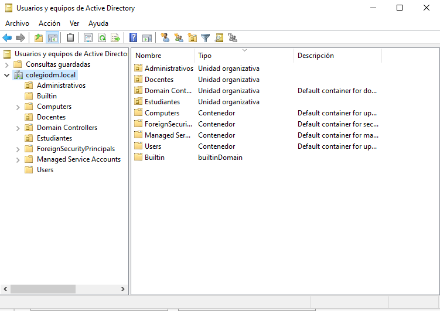
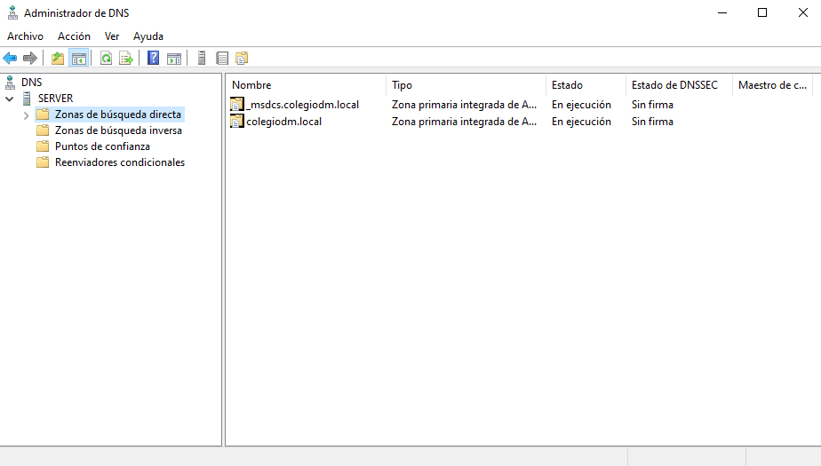
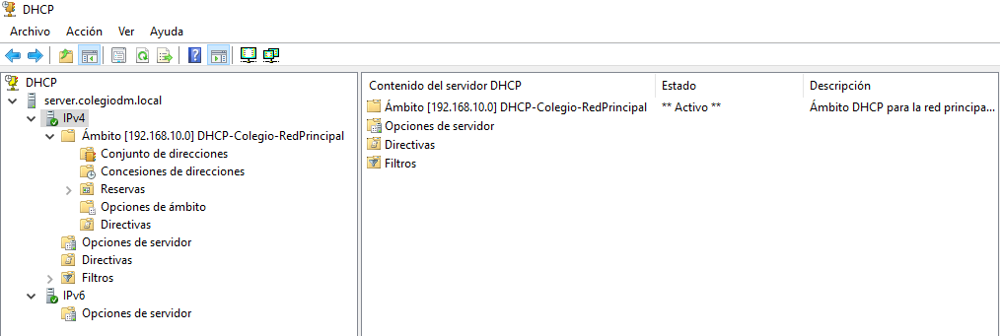

# Pasos de Instalación y Configuración del Servidor

Este documento describe los pasos realizados para la instalación y configuración de un servidor *Windows Server 2022*, el cual actúa como *Controlador de Dominio* en un entorno educativo basado en el dominio **`colegio.dm`**.

> **Nota:** El dominio y el bosque ya se encontraban implementados al momento de documentar este proyecto.  
> Los pasos descritos corresponden al proceso real ejecutado previamente y verificado durante el laboratorio.

---

## 1. Instalación del sistema operativo

Se realizó la instalación de **Windows Server 2022 (Desktop Experience)**, seguida de la configuración inicial del sistema.

Acciones realizadas:
- Asignación de nombre al servidor
- Configuración de dirección IP estática
- Configuración inicial del sistema

📸 Evidencia:  

---

## 2. Instalación de roles y características

Se instalaron los roles necesarios para la administración centralizada del entorno.

Roles instalados:
- Active Directory Domain Services (AD DS)
- DNS Server
- DHCP Server

📸 Evidencia:  

---

## 3. Promoción a Controlador de Dominio

El servidor fue promovido a **Controlador de Dominio**, creando un nuevo bosque para el entorno educativo.

Configuración realizada:
- Creación de nuevo bosque
- Dominio configurado: `colegio.dm`
- Nivel funcional por defecto

📸 Evidencia:  

---

## 4. Configuración del servicio DNS

Durante la promoción del servidor a Controlador de Dominio, se creó automáticamente la zona de búsqueda directa **`colegio.dm`**, integrada con Active Directory para la resolución de nombres interna.

Se verificó la correcta creación de los registros necesarios para el funcionamiento del dominio.

📸 Evidencia:  

---

## 5. Configuración del servicio DHCP

Se configuró el servicio DHCP para permitir la asignación automática de direcciones IP a los equipos del dominio.

Configuraciones realizadas:
- Creación de un ámbito de red
- Asignación automática de direcciones IP
- Configuración de gateway y servidor DNS

📸 Evidencia:  

---

## 6. Verificación del entorno

Se verificó el correcto funcionamiento de los servicios configurados, confirmando que el servidor opera correctamente como Controlador de Dominio.

📸 Evidencia:  

